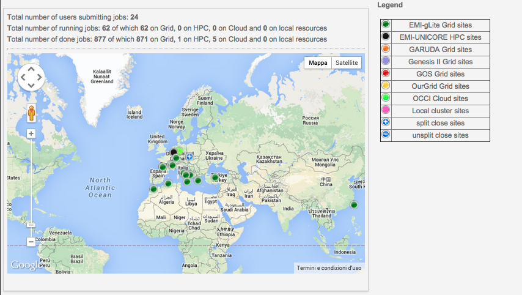

# INTEROPERABILITY DEMO

## About

The map below shows cumulative information about users running the Demo Applications on the various Grid, HPC, Cloud and local resources supported by the CHAIN-REDS Science Gateway. The legend on the right shows the correspondence between marker colours and types of sites.
Click on the markers which appear on the map to get more information about running and done (i.e., whose output has not yet been retrieved) jobs at a given site. Job statuses are automatically updated every 15 minute.

## Contributors

* [Rita Ricceri](mailto:rita.ricceri@ct.infn.it)

